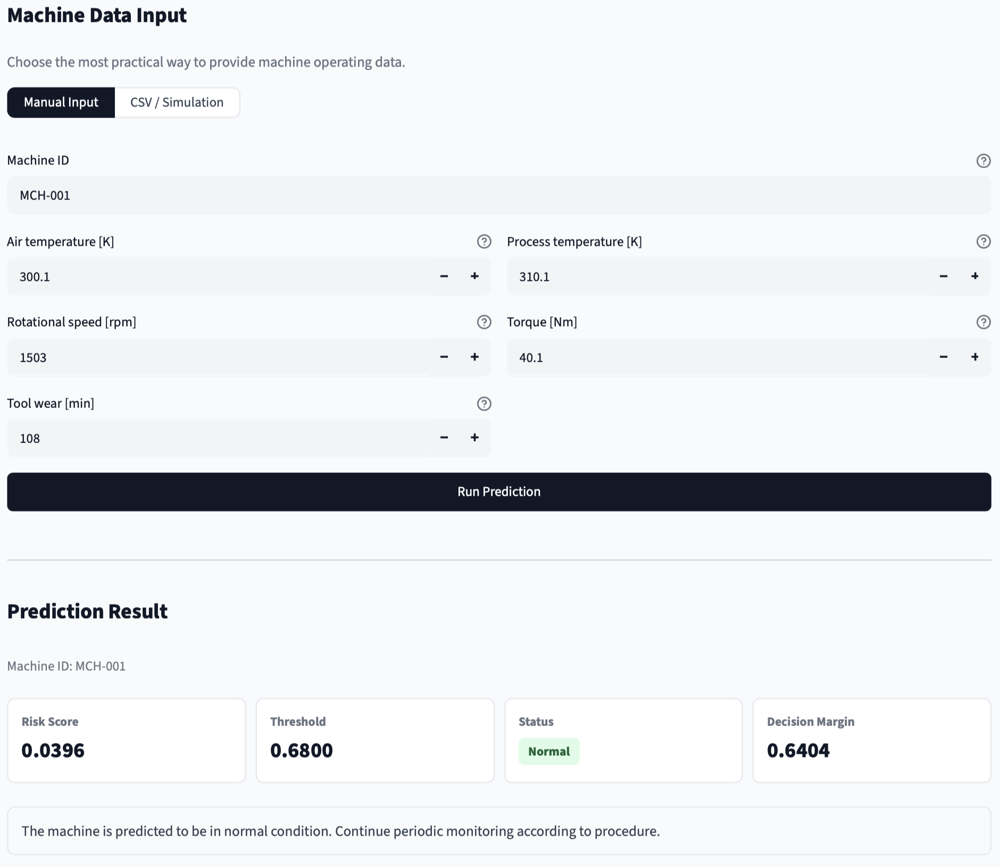
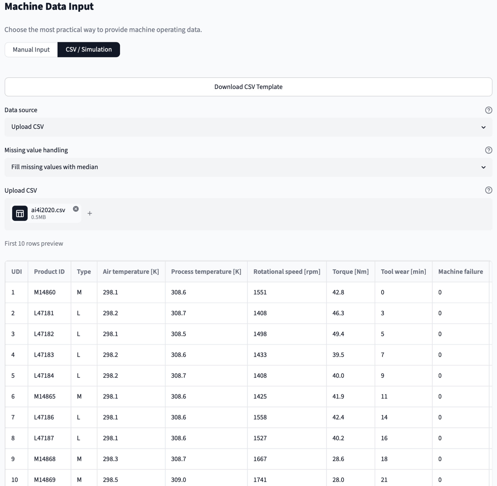
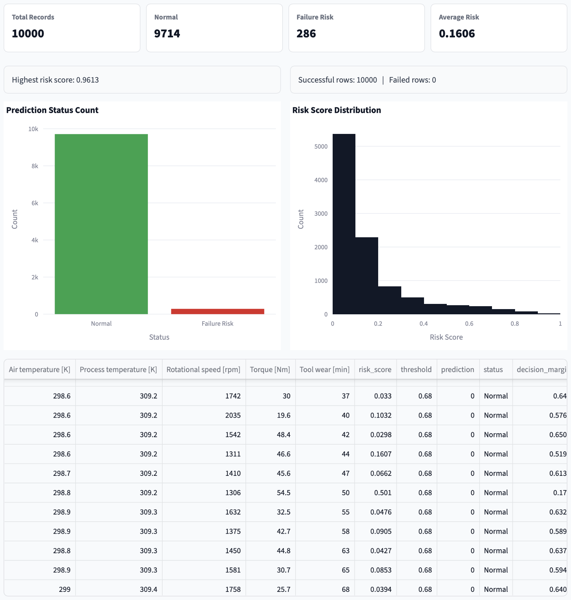
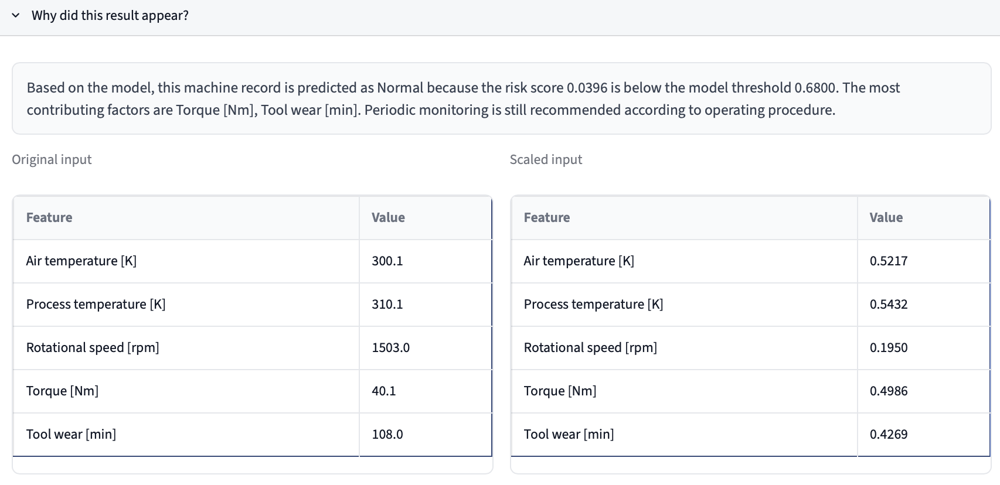
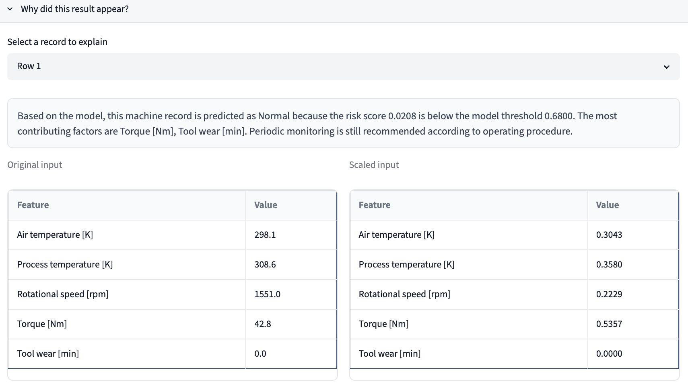
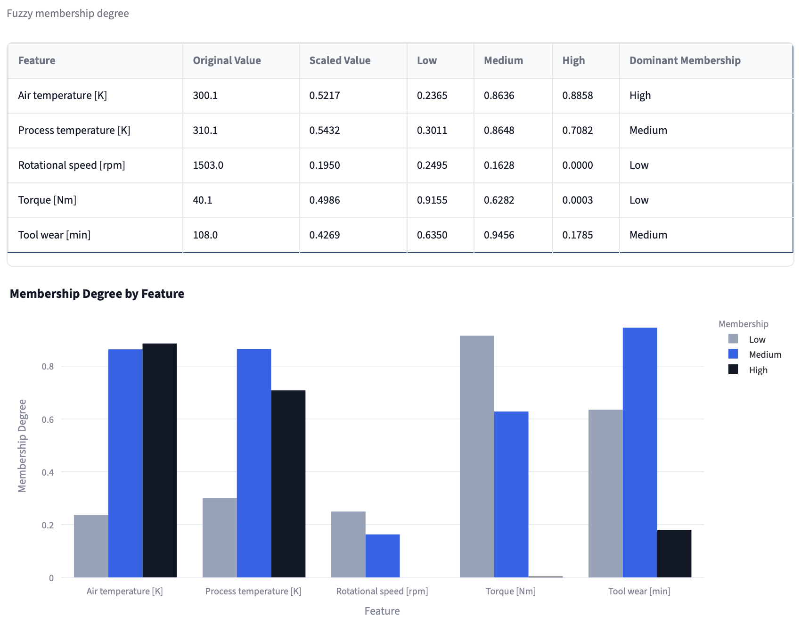
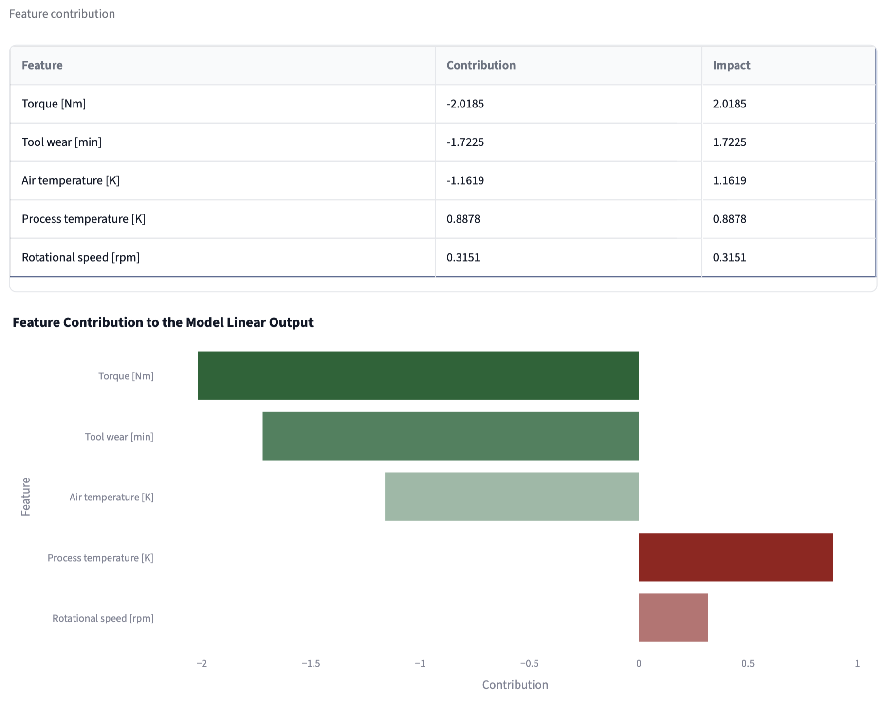

# Industrial Machine Failure Prediction

Early industrial machine failure prediction system using an Adaptive Neuro-Fuzzy Inference System (ANFIS) model optimized with a Genetic Algorithm (GA). The application is built with the Streamlit framework and is designed for inference, prediction visualization, data simulation, and interactive, user-friendly explanation of machine failure risks.

This application is non-invasive, meaning it does not retrain the model and does not modify the original dataset, Jupyter notebook, scaler object, or model parameter files.

## Table of Contents

- [Project Overview](#project-overview)
- [Project Structure](#project-structure)
- [Installation and Configuration Guide](#installation-and-configuration-guide)
- [Running the Application](#running-the-application)
- [Detailed User Guide](#detailed-user-guide)
  - [Manual Input Mode](#1-manual-input-mode)
  - [CSV Upload Mode](#2-csv-upload-mode)
  - [Generate Simulation Mode](#3-generate-simulation-mode)
- [Analysis and Output Interpretation](#analysis-and-output-interpretation)
  - [Prediction Metrics (Metric Cards)](#1-prediction-metrics-metric-cards)
  - [Maintenance Recommendation](#2-maintenance-recommendation)
  - [Decision Explanation Panel](#3-decision-explanation-panel)
  - [Batch Prediction Graphs (Batch Mode Only)](#4-batch-prediction-graphs-batch-mode-only)
- [Technical Details](#technical-details)
- [System Limits and Data Privacy](#system-limits-and-data-privacy)
- [Troubleshooting](#troubleshooting)

## Project Overview

This project predicts whether an industrial machine is in a normal operating condition or at failure risk based on five main operating parameters:

1. **Air temperature [K]**: Ambient air temperature around the machine, measured in Kelvin (dataset range: 295.3 K to 304.5 K).
2. **Process temperature [K]**: Process-side operating temperature, measured in Kelvin (dataset range: 305.7 K to 313.8 K).
3. **Rotational speed [rpm]**: Shaft or spindle rotational speed, measured in revolutions per minute (dataset range: 1168.0 rpm to 2886.0 rpm).
4. **Torque [Nm]**: Mechanical torque load applied to the machine, measured in Newton-meters (dataset range: 3.8 Nm to 76.6 Nm).
5. **Tool wear [min]**: Estimated accumulated tool wear time, measured in minutes (dataset range: 0.0 min to 253.0 min).

The application loads the trained model artifacts from the `models/` directory, applies the exact same preprocessing and inference flow used in the experimental notebook, and displays:

- Risk score of failure (risk score)
- Model decision threshold (threshold)
- Prediction status (Normal or Failure Risk)
- Decision margin (decision margin)
- Recommended maintenance action
- Fuzzy membership explanation
- Feature contribution analysis
- Batch prediction table for multiple records
- Graphical representation of batch statistics and distribution

## Project Structure

The structure of folders and files in this project is as follows:

* **app.py**: Main Streamlit application script.
* **requirements.txt**: List of required Python library dependencies.
* **README.md**: This documentation file.
* **dataset/**
  * **ai4i2020.csv**: Reference dataset for statistics and simulation.
* **models/**
  * **anfis_with_ga_params.pkl**: ANFIS model parameters optimized with Genetic Algorithm.
  * **anfis_without_ga_params.pkl**: ANFIS model parameters without Genetic Algorithm optimization.
  * **feature_columns.pkl**: List of feature names used by the model.
  * **scaler.pkl**: Scaler object for feature normalization before inference.
* **notebook/**
  * **230011_230057_230079_Kode_Program_UAS_Softcom....ipynb**: Initial research Jupyter notebook.
* **public/**
  * **webIcon.png**: Browser tab icon for the web application.
  * **manual_input.png**: User guide screenshot: Manual Input panel.
  * **record_detail.png**: User guide screenshot: Row inputs and fuzzy membership table.
  * **explanation_detail.png**: User guide screenshot: Decision Narrative panel.
  * **fuzzy_membership.png**: User guide screenshot: Fuzzy Membership Degree chart.
  * **feature_contribution.png**: User guide screenshot: Feature Contribution chart.
  * **csv_input_handle-1.png**: User guide screenshot: Drop rows with missing values option.
  * **csv_input_handle-2.png**: User guide screenshot: Fill missing values with median option.
  * **csv_results.png**: User guide screenshot: CSV batch prediction results.
* **utils/**
  * **__init__.py**: Module initialization.
  * **inference.py**: ANFIS inference logic, risk scoring, and model loading.
  * **explanation.py**: Prediction narrative generator and feature contribution table.
  * **data_generator.py**: Simulation data generator based on dataset statistics.
  * **validation.py**: Input verification and missing value handling.
  * **ui_style.py**: Custom stylesheet and UI design configuration.

## Installation and Configuration Guide

Follow the steps below to set up your environment and install the required packages before running the application.

### 1. Navigate to the Project Directory

Open a terminal or command prompt and change your working directory to the project root:

```bash
cd predictive-maintenance
```

### 2. Create a Virtual Environment

It is highly recommended to use a virtual environment to prevent package version conflicts.

For Windows:

```bash
python -m venv .venv
.venv\Scripts\activate
```

For macOS or Linux:

```bash
python -m venv .venv
source .venv/bin/activate
```

### 3. Install Dependencies

Install all the required Python packages specified in `requirements.txt` using the pip package manager:

```bash
pip install -r requirements.txt
```

## Running the Application

Once the installation is complete, start the Streamlit server from the root of the project:

```bash
streamlit run app.py
```

Streamlit will boot up the application and display local URL addresses in the terminal:

```text
http://localhost:8501
```

Open this URL in a web browser to access the interactive dashboard.

## Detailed User Guide

The application interface is structured from top to bottom: App Header, Machine Data Input, Prediction Result, Explanation Panel, and System Information.

The application offers two primary modes for inputting machine operating data. You can switch between them using the selector control in the "Machine Data Input" section.

### 1. Manual Input Mode

Use this mode when you want to analyze the risk score and failure status of a single machine in real-time.



How to use:
1. Select the **Manual Input** option.
2. Enter a unique identifier in the **Machine ID** text box (default: MCH-001). This field is optional and is used to label the results.
3. Use the numeric input boxes to enter the current operating values for the machine:
   - **Air temperature [K]**
   - **Process temperature [K]**
   - **Rotational speed [rpm]**
   - **Torque [Nm]**
   - **Tool wear [min]**
4. If any entered value falls outside the normal ranges found in the training dataset, a warnings box will appear. These warnings are informative and advise you that the model is predicting outside its typical data domain.
5. Click the **Run Prediction** button.
6. The system will evaluate the parameters, refresh the "Prediction Result" cards, and generate explanation summaries.

### 2. CSV Upload Mode

Use this mode to analyze multiple machine records simultaneously using a formatted CSV file.

How to use:
1. Select the **CSV / Simulation** option.
2. Set the **Data source** dropdown to **Upload CSV**.
3. If you do not have a CSV file ready, click the **Download CSV Template** button to get a pre-formatted file named `machine_prediction_template.csv` with correct column headers.
4. Prepare your file. The following columns must be present with identical spelling:
   - `Air temperature [K]`
   - `Process temperature [K]`
   - `Rotational speed [rpm]`
   - `Torque [Nm]`
   - `Tool wear [min]`
   Other columns like `Machine ID`, `Timestamp`, `Location`, and `Operator` are optional metadata columns.
5. Select a missing data strategy from the **Missing value handling** dropdown:
   - **Drop rows with missing values**: Excludes any row containing empty cells in the required feature columns.

     

   - **Fill missing values with median**: Fills empty cells in the required feature columns with the median values of the original training dataset.

     

6. Drag and drop or upload your CSV file into the file uploader.
7. A preview of the first 10 rows will be displayed along with validation feedback. Any row containing non-numeric values in required fields will be marked with error flags.
8. Click **Run Batch Prediction**.
9. The batch results will display summary cards, status counts, risk distributions, a comprehensive output table, and a download button to export the results.

   

### 3. Generate Simulation Mode

This mode allows you to generate realistic machine records based on the original dataset statistics to test the application's functionality.

How to use:
1. Select the **CSV / Simulation** option.
2. Set the **Data source** dropdown to **Generate Simulation**.
3. Input the number of rows to create in the **Number of records** field (ranges from 1 to 500).
4. Select one of the simulation scenarios from the **Simulation scenario** dropdown:
   - **Normal Operation**: Generates data within standard limits where the machine operates normally (features sampled around the dataset medians).
   - **High Tool Wear**: Generates data where the tool wear parameter is near or above the 75th percentile (potential failure due to tool degradation).
   - **High Torque**: Generates data where the load torque is near or above the 75th percentile (potential mechanical stress failure).
   - **Low Speed High Torque**: Generates data combining low rotational speeds with high torque (extreme operating conditions).
   - **Mixed Condition**: Generates a random mix of all the above scenarios to simulate a varied production line.
5. Click **Generate Simulation Data**. The system will create simulated records with random statistical noise (jitter) to ensure realistic variation while keeping features within dataset bounds.
6. You can download this simulated dataset by clicking the **Download Generated Simulation Data** button.
7. Click **Run Batch Prediction** to process the simulated rows.

## Analysis and Output Interpretation

Once the prediction is completed, the results are visualized. Here is how to interpret the model outputs:

### 1. Prediction Metrics (Metric Cards)
- **Risk Score**: A value between 0.0000 (very safe) and 1.0000 (highest risk of failure), indicating the probability of machine failure. This is computed by applying a sigmoid function on the ANFIS linear consequent outputs.
- **Threshold**: The decision boundary of the model. If the Risk Score is equal to or greater than the Threshold, the machine is classified as at risk. This boundary is loaded dynamically from the model artifact (default value is approximately 0.4900).
- **Status**: The final classification. A status of **Failure Risk** is displayed in red, and a status of **Normal** is displayed in green.
- **Decision Margin**: The absolute difference between the Risk Score and the Threshold. A small decision margin indicates that the machine is operating close to the classification boundary.

### 2. Maintenance Recommendation
A colored box displays the recommended action:
- **Normal Status**: Advises continuing routine monitoring according to standard procedure.
- **Failure Risk Status**: Provides a warning and lists the top two parameters contributing most to the risk score, helping technicians prioritize inspection areas.

### 3. Decision Explanation Panel

You can expand the "Why did this result appear?" section to understand the model's reasoning. For batch predictions, you can use the dropdown to select which row to explain.



The explanation includes:
- **Prediction Narrative**: A natural language description of the classification result and the main operating parameters that caused it.
- **Original vs. Scaled Input and Fuzzy Membership**: Side-by-side tables showing raw values, scaled equivalents (normalized using a Z-score scaler), and the fuzzy membership degree table.

  

- **Fuzzy Membership Degrees**: A grouped bar chart showing the degree (between 0.0 and 1.0) to which each parameter belongs to the Low, Medium, and High fuzzy sets.

  

- **Feature Contributions**: A table and a horizontal bar chart showing the linear contribution of each feature to the model output. Positive contributions increase the failure risk score, while negative contributions decrease it.

  

### 4. Batch Prediction Graphs (Batch Mode Only)
- **Prediction Status Count**: A bar chart displaying the count of machines classified as Normal versus those at Failure Risk.
- **Risk Score Distribution**: A histogram showing the distribution of risk scores across all processed rows to help visualize the overall health of the machine fleet.

## Technical Details

The prediction system is powered by:
- **Core Model**: Adaptive Neuro-Fuzzy Inference System (ANFIS). It combines the transparent rule-based reasoning of fuzzy logic with the learning capabilities of artificial neural networks.
- **Genetic Algorithm Optimization**: The parameters of the Gaussian membership functions (center and sigma) and the decision threshold were optimized during training using a Genetic Algorithm to maximize accuracy and F1-score.
- **Dynamic Thresholding**: The decision threshold is read dynamically from the model file (`anfis_with_ga_params.pkl`), ensuring complete consistency with the original research.

## System Limits and Data Privacy

Keep in mind the following operational aspects:
1. **Decision Support Only**: This system is a decision-support tool. It should not be the sole basis for maintenance actions. All maintenance decisions must be reviewed and validated by a qualified technician or operator.
2. **Data Privacy**: Operational parameters can contain sensitive business information (such as line layouts or performance profiles). The application runs locally or on your isolated server. Uploaded CSVs, generated simulation data, and prediction results are kept in memory and are not stored permanently.
3. **Inference Only**: The application is configured exclusively for model inference and explanation. It does not contain features to train or retrain the model.

## Troubleshooting

### Application fails to start or crashes
1. Verify that you are executing `streamlit run app.py` from the root directory of the project, not from inside the `utils` or `models` directories.
2. Ensure that the required model artifacts (`anfis_with_ga_params.pkl`, `scaler.pkl`, and `feature_columns.pkl`) are in the `models/` folder.
3. Confirm that the reference dataset (`dataset/ai4i2020.csv`) is present.
4. Ensure your virtual environment is active and all required libraries are installed by running `pip install -r requirements.txt`.

### CSV Upload fails or results in row errors
1. Open the CSV file in a text editor to verify that the required column names are spelled exactly as required (e.g., `Air temperature [K]` is case-sensitive and must include the brackets).
2. Check that the cells in the feature columns contain only numbers (no letters, trailing characters, or special symbols).
3. If your CSV file has missing data, choose the "Fill missing values with median" option to prevent rows from being dropped during validation.
